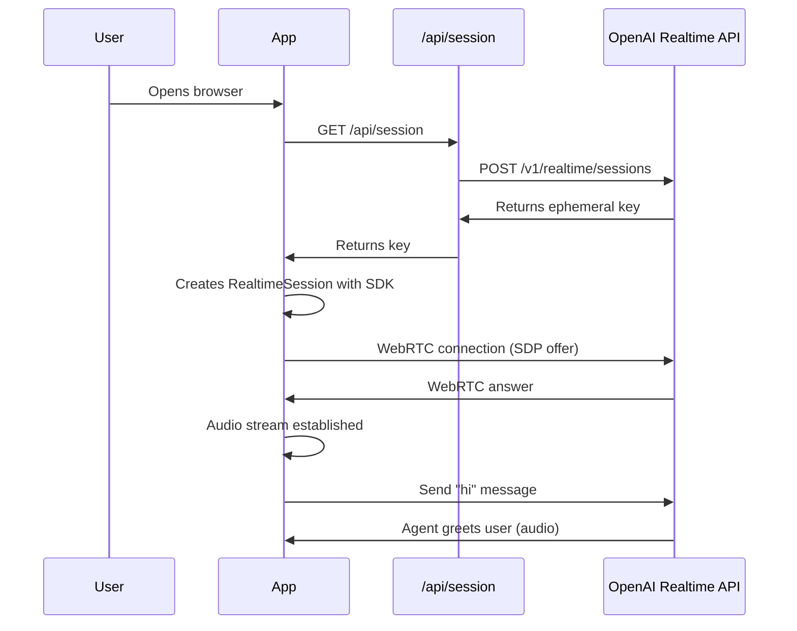
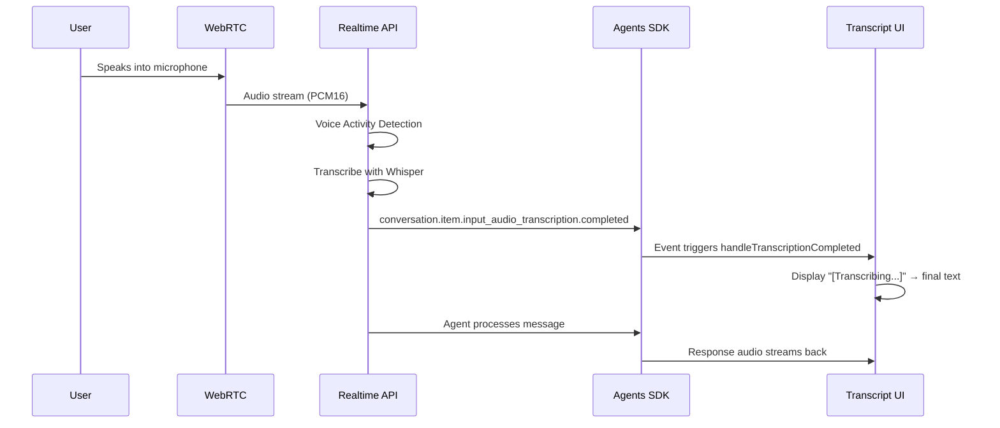
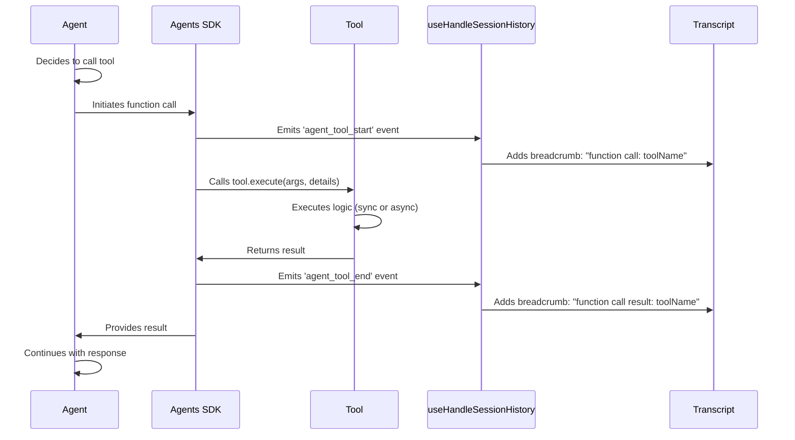
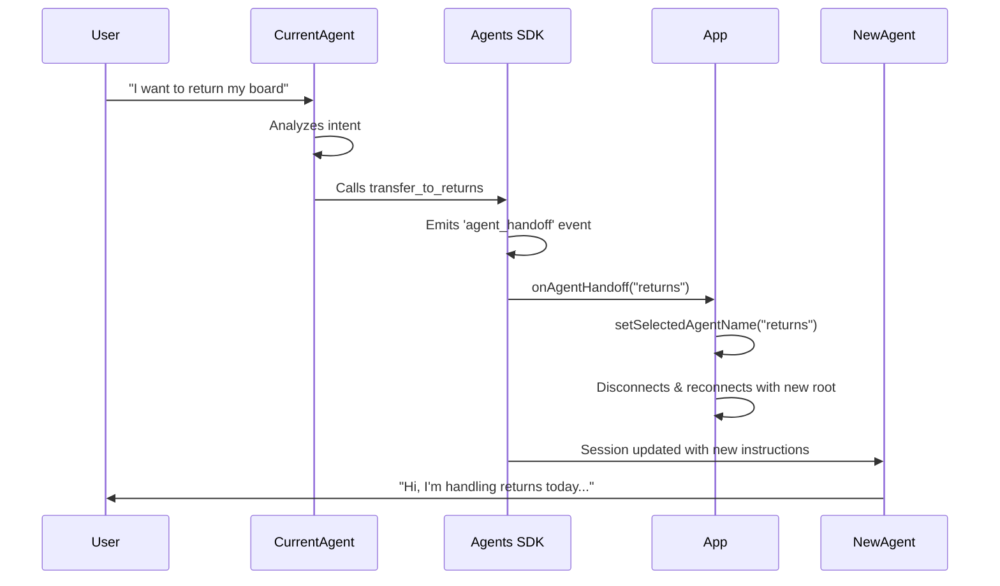
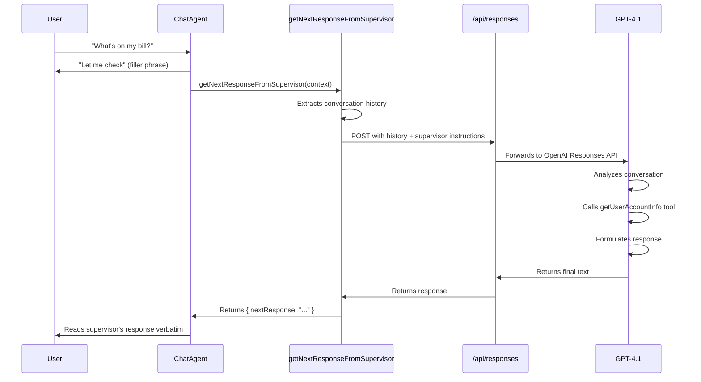
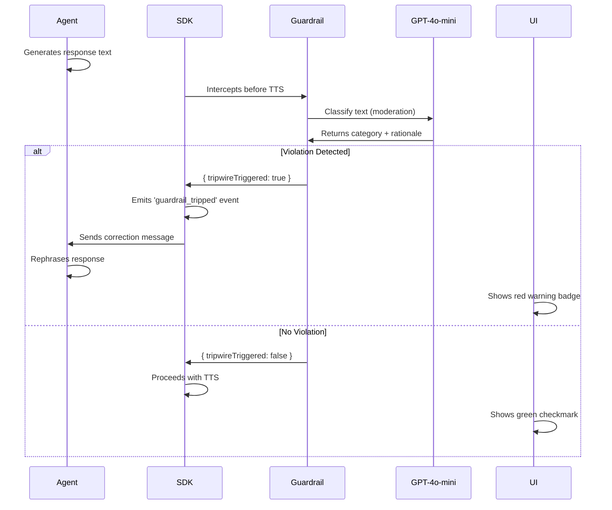

# System Architecture

## Three-Layer Architecture

The application follows a clean three-layer architecture:

```
┌────────────────────────────────────────────────────────────────┐
│  Layer 1: Frontend (Next.js Client)                            │
│  - React components & UI state management                      │
│  - WebRTC connection management                                │
│  - Event processing and display                                │
└────────────┬───────────────────────────────────────────────────┘
             │
             │ HTTP (ephemeral keys)
             │ WebRTC (audio + events)
             │
┌────────────▼───────────────────────────────────────────────────┐
│  Layer 2: Next.js API Routes (Server-side)                     │
│  - /api/session: Generates ephemeral keys                      │
│  - /api/responses: Proxies to OpenAI Responses API             │
└────────────┬───────────────────────────────────────────────────┘
             │
             │ HTTPS to OpenAI
             │
┌────────────▼───────────────────────────────────────────────────┐
│  Layer 3: OpenAI Services                                      │
│  - Realtime API (voice agents, WebRTC)                         │
│  - Responses API (supervisor model)                            │
└────────────────────────────────────────────────────────────────┘
```

## Data Flow: Complete User Interaction

### 1. Initial Connection Flow



**Key Files:**
- `App.tsx` (`connectToRealtime` function)
- `api/session/route.ts`
- `hooks/useRealtimeSession.ts` (`connect` function)

### 2. Message Flow (User Speaks)



**Key Files:**
- `hooks/useHandleSessionHistory.ts` (`handleTranscriptionCompleted`)
- `contexts/TranscriptContext.tsx` (`addTranscriptMessage`)

### 3. Tool Call Flow



**Key Files:**
- `agentConfigs/customerServiceRetail/authentication.ts` (tool definitions)
- `hooks/useHandleSessionHistory.ts` (`handleAgentToolStart`, `handleAgentToolEnd`)

### 4. Agent Handoff Flow



**Key Files:**
- `App.tsx` (`handleSelectedAgentChange`, `onAgentHandoff` callback)
- `hooks/useRealtimeSession.ts` (`handleAgentHandoff`)
- `agentConfigs/customerServiceRetail/index.ts` (handoff configuration)

### 5. Chat-Supervisor Pattern Flow



**Key Files:**
- `agentConfigs/chatSupervisor/index.ts` (chat agent definition)
- `agentConfigs/chatSupervisor/supervisorAgent.ts` (`getNextResponseFromSupervisor` tool)
- `api/responses/route.ts` (API proxy)

### 6. Guardrail Flow



**Key Files:**
- `agentConfigs/guardrails.ts` (`createModerationGuardrail`)
- `App.tsx` (guardrail setup in `connectToRealtime`)
- `hooks/useHandleSessionHistory.ts` (`handleGuardrailTripped`)

## WebRTC Connection Details

### Audio Stream Setup

```typescript
// 1. Create audio element for playback
const audioElement = document.createElement('audio');
audioElement.autoplay = true;

// 2. Create RealtimeSession with WebRTC transport
const session = new RealtimeSession(rootAgent, {
  transport: new OpenAIRealtimeWebRTC({
    audioElement,
    changePeerConnection: async (pc) => {
      // Apply codec preferences (opus/pcmu/pcma)
      applyCodecPreferences(pc, selectedCodec);
      return pc;
    },
  }),
  config: {
    inputAudioFormat: 'pcm16',   // or g711_ulaw/g711_alaw
    outputAudioFormat: 'pcm16',
    inputAudioTranscription: {
      model: 'gpt-4o-mini-transcribe',
      language: 'en', // Explicitly set to English to prevent language mixing
    },
  },
});

// 3. Connect with ephemeral key
await session.connect({ apiKey: ephemeralKey });
```

### Audio Formats

| Codec | Sample Rate | Use Case |
|-------|-------------|----------|
| **opus** (pcm16) | 48 kHz | High quality, default |
| **pcmu** (g711_ulaw) | 8 kHz | Phone line simulation |
| **pcma** (g711_alaw) | 8 kHz | Phone line simulation |

### Push-to-Talk (PTT) vs Voice Activity Detection (VAD)

**VAD Mode (Default):**
```typescript
session.transport.sendEvent({
  type: 'session.update',
  session: {
    turn_detection: {
      type: 'server_vad',
      threshold: 0.92, // Higher threshold to prevent echo/feedback
      prefix_padding_ms: 300,
      silence_duration_ms: 1200, // Longer silence to prevent picking up agent's voice
      create_response: true,
    },
  },
});
```

**PTT Mode:**
```typescript
// Disable VAD
session.transport.sendEvent({
  type: 'session.update',
  session: { turn_detection: null },
});

// When button pressed
session.transport.sendEvent({ type: 'input_audio_buffer.clear' });

// When button released
session.transport.sendEvent({ type: 'input_audio_buffer.commit' });
session.transport.sendEvent({ type: 'response.create' });
```

## State Management

### Context Providers

**TranscriptContext:**
- Manages conversation history (messages + breadcrumbs)
- Methods: `addTranscriptMessage`, `updateTranscriptMessage`, `addTranscriptBreadcrumb`
- Used by: All components displaying conversation

**EventContext:**
- Manages event log for debugging
- Methods: `logClientEvent`, `logServerEvent`
- Used by: Events component, debugging

### Local Storage Persistence

```typescript
// Persisted settings
localStorage.setItem('pushToTalkUI', isPTTActive.toString());
localStorage.setItem('audioPlaybackEnabled', isAudioPlaybackEnabled.toString());
localStorage.setItem('logsExpanded', isEventsPaneExpanded.toString());
```

## Next Steps

- [Components Guide](./03-COMPONENTS.md) - Detailed component documentation
- [Extending Guide](./04-EXTENDING.md) - How to add features
- [Best Practices](./05-BEST-PRACTICES.md) - Tips and troubleshooting

