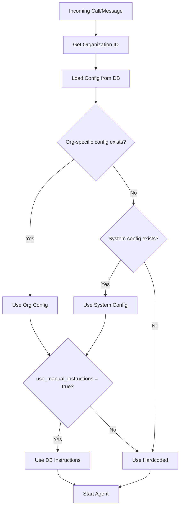
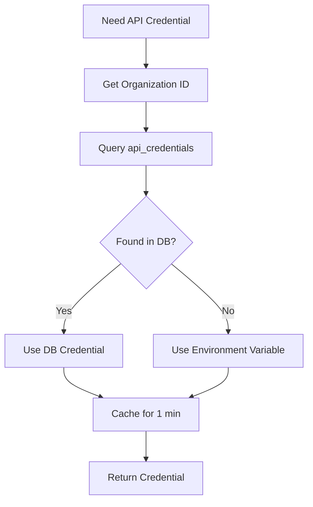

# Multi-Channel Agent Configuration System

**Last Updated:** January 16, 2026

## Overview

A comprehensive system for managing AI agent configurations across multiple communication channels with per-organization customization and centralized API credential management.

## Architecture

### Communication Channels

1. **Twilio Voice** - Phone calls with two modes:
   - **Premium**: Single agent (gpt-4o-realtime) - Full power, higher cost
   - **Standard**: Two agents (gpt-4o-mini + gpt-4o supervisor) - Cost-optimized

2. **Web Agent** - Browser-based agent with same two modes as Twilio

3. **WhatsApp** - Text messaging (gpt-4o, single agent)

### Configuration Layers

```
Organization-Specific Config (DB)
         ↓ (fallback)
System-Wide Config (DB)
         ↓ (fallback)
Hardcoded Instructions (Code)
```

## Database Schema

### Tables Created

#### 1. `agent_configurations` (Enhanced)

**New Fields:**
- `organization_id UUID` - Links config to organization (NULL = system-wide)
- `whatsapp_instructions TEXT` - WhatsApp-specific instructions
- `channel TEXT` - Channel type (twilio, web, whatsapp, system)

**Existing Fields:**
- `manual_ai_instructions` - Premium mode (Twilio + Web)
- `receptionist_instructions` - Standard mode receptionist (Twilio + Web)
- `supervisor_instructions` - Standard mode supervisor (Twilio + Web)
- `use_manual_instructions` - Toggle DB vs hardcoded

#### 2. `api_credentials` (New)

Stores API keys and credentials per organization:

```sql
CREATE TABLE api_credentials (
  id UUID PRIMARY KEY,
  organization_id UUID NOT NULL,
  credential_type credential_type,  -- openai, twilio, evolution_api, opendental, retell
  credential_name TEXT,              -- User-friendly name
  credentials JSONB,                 -- Actual credentials
  is_active BOOLEAN,
  is_default BOOLEAN,                -- One default per type per org
  last_used_at TIMESTAMPTZ,
  expires_at TIMESTAMPTZ
);
```

**Credential Structures:**

```typescript
// OpenAI
{ api_key: string }

// Twilio
{ 
  account_sid: string,
  auth_token: string,
  phone_number: string,
  websocket_url: string
}

// Evolution API (WhatsApp)
{ 
  api_url: string,
  api_key: string
}

// OpenDental
{ 
  api_url: string,
  api_key: string
}
```

## Admin UI

### Settings Page (`/admin/booking/settings`)

**Structure:**
1. **Agent Mode Selector** - Premium vs Standard (affects Twilio + Web)
2. **API Configuration Card** - Quick status + link to API Keys page
3. **Web Testing Card** - Launch web agent test interface
4. **Workflows Editor** (password-protected):
   - **Twilio Voice Tab**: Premium + Standard (receptionist + supervisor) configs
   - **Web Agent Tab**: Premium + Standard configs (shared with Twilio)
   - **WhatsApp Tab**: Single-agent text-based config

### API Keys Page (`/admin/booking/api-keys`)

**Features:**
- List all configured credentials
- Add/Edit/Delete credentials
- Set default credential per type
- Mask sensitive fields (API keys, tokens)
- Toggle visibility for secret fields
- Security notice and best practices

**Supported Services:**
- OpenAI (GPT-4o, GPT-4o-mini)
- Twilio (Voice calls, SMS)
- Evolution API (WhatsApp)
- OpenDental (Practice management)
- Retell AI (Voice)
- Other (Custom integrations)

## Code Structure

### Core Libraries

**`src/app/lib/agentMode.ts`**
- `getAgentMode()` - Get Premium vs Standard mode
- `getOrganizationInstructions(orgId, channel)` - Load instructions with fallback
- `getAgentInstructions()` - Legacy system-wide loader

**`src/app/lib/callHelpers.ts`**
- `getOrganizationIdFromCall(callSid)` - Lookup org from Twilio call
- `getOrganizationIdFromWhatsAppInstance(instanceId)` - Lookup org from WhatsApp
- `getCachedDefaultOrganizationId()` - Fast default org lookup

**`src/app/lib/credentialLoader.ts`**
- `getCredentials(orgId, type)` - Load credentials with env fallback
- `getOpenAIKey(orgId)` - Convenience wrapper
- `getTwilioCredentials(orgId)` - Convenience wrapper
- `getEvolutionAPICredentials(orgId)` - Convenience wrapper
- `clearCredentialCache(orgId)` - Cache invalidation

### Channel Handlers

**Twilio Premium** (`src/twilio/websocket-handler.ts`)
- Loads instructions from DB on connection
- Uses `getOrganizationInstructions(orgId, 'twilio')`
- Falls back to hardcoded if DB unavailable

**Twilio Standard** (`src/twilio/websocket-handler-standard.ts`)
- Loads receptionist + supervisor instructions
- Uses `getOrganizationInstructions(orgId, 'twilio')`
- Falls back to hardcoded

**WhatsApp** (`src/app/lib/whatsapp/messageHandler.ts`)
- Loads instructions per message
- Uses `getOrganizationInstructions(orgId, 'whatsapp')`
- Falls back to `generateLexiInstructions(false)`

**Web Agent** (`src/app/agentConfigs/embeddedBooking/`)
- `lexiAgent.ts` - Premium mode
- `lexiStandardAgent.ts` - Standard mode (has `loadInstructionsFromDB()`)
- Already supports DB loading via `/api/admin/agent-instructions`

## Usage Guide

### Initial Setup

**1. Run Database Migrations**
```bash
# Apply new migrations
psql -d your_database -f supabase/migrations/043_multi_channel_agent_config.sql
psql -d your_database -f supabase/migrations/044_api_credentials.sql

# Or via Supabase CLI
npx supabase db push
```

**2. Seed Instructions**
1. Go to `/admin/booking/settings`
2. Unlock Workflows (password: `lexi2026`)
3. Click "Sync Instructions"
4. Verify all instruction fields populated

**3. Configure API Keys (Optional)**
1. Go to `/admin/booking/api-keys`
2. Click "Add Credential"
3. Select service type (OpenAI, Twilio, etc.)
4. Enter credentials
5. Mark as default

### Per-Organization Customization

**Scenario:** Different dental offices with different agent behavior

**Office A - Casual & Friendly:**
```
1. Set instructions for Org A
2. Edit Twilio > Premium: "You're super casual and use lots of friendly phrases"
3. Save changes
4. Test: Call routes to Org A → uses casual instructions
```

**Office B - Professional & Formal:**
```
1. Set instructions for Org B
2. Edit Twilio > Premium: "You're professional and formal at all times"
3. Save changes
4. Test: Call routes to Org B → uses formal instructions
```

### Customizing WhatsApp

WhatsApp has separate instructions because:
- Text-only (no voice nuances)
- Async conversation (not real-time)
- Can use markdown formatting
- Different interaction patterns

**Example WhatsApp Customizations:**
```
- Use emojis (not suitable for voice)
- Include bullet points and lists
- Share links directly
- More detailed explanations (no time pressure)
```

## API Endpoints

### Agent Instructions

**GET `/api/admin/agent-instructions`**
- Returns: All instruction types for current org (with system fallback)
- Auth: Required
- Returns: `premiumInstructions`, `receptionistInstructions`, `supervisorInstructions`, `whatsappInstructions`

**POST `/api/admin/agent-instructions`**
- Body: All instruction fields + `channel`
- Creates/updates org-specific configuration
- Auth: Owner or Admin required

**POST `/api/admin/seed-instructions`**
- Seeds database with current hardcoded instructions
- One-time operation after code updates
- Auth: Owner or Admin required

### API Credentials

**GET `/api/admin/api-credentials`**
- Returns: All credentials for current organization
- Credentials are returned in full (secure endpoint)

**POST `/api/admin/api-credentials`**
- Body: `{ credential_type, credential_name, description, credentials, is_default }`
- Creates new credential
- Auth: Owner or Admin required

**PUT `/api/admin/api-credentials/[credentialId]`**
- Updates existing credential
- Auth: Owner or Admin required

**DELETE `/api/admin/api-credentials/[credentialId]`**
- Deletes credential
- Auth: Owner only

**GET `/api/admin/api-credentials/status`**
- Returns: Quick status of which services are configured
- Used by settings page for status indicators

## Runtime Behavior

### Instruction Loading Flow



### Credential Loading Flow



## Security

### Credentials Protection

1. **Row Level Security (RLS)**: Users can only access their organization's credentials
2. **Role-Based Access**: 
   - View: All organization members
   - Create/Update: Owner and Admin only
   - Delete: Owner only
3. **Masked Display**: Secret fields masked in UI (show/hide toggle)
4. **No Logging**: Credentials never logged to console
5. **Encrypted Storage**: JSONB field in database (recommend encryption at rest)

### Best Practices

- Rotate API keys regularly (quarterly recommended)
- Use separate keys for development vs production
- Set expiration dates on credentials where possible
- Monitor `last_used_at` to identify unused credentials
- Disable credentials instead of deleting (maintains audit trail)

## Multi-Tenancy Support

### How It Works

1. **Organization Lookup**: Every call/message → organization ID
2. **Config Query**: Check for org-specific config
3. **Fallback Chain**: Org-specific → System-wide → Hardcoded
4. **Credential Isolation**: Each org uses their own API keys

### Shared vs Isolated Resources

**Shared (System-Wide):**
- Default instructions (if org doesn't customize)
- Code-level configurations
- Default API keys (from env vars)

**Isolated (Per-Organization):**
- Custom agent instructions
- API credentials (Twilio, OpenAI, etc.)
- Conversation history
- Patient data
- Appointments

## Cost Optimization

### Using Database Credentials

**Benefits:**
- Each org can use their own OpenAI/Twilio accounts
- Separate billing per organization
- Individual usage tracking
- Custom rate limits

**Example Setup:**
```
Org A: Uses their OpenAI key ($100/month usage)
Org B: Uses platform's OpenAI key (billed to them)
Org C: Uses their own OpenAI key ($50/month usage)
```

## Troubleshooting

### Instructions Not Loading

**Check:**
1. Database migration applied? (`\d agent_configurations`)
2. Instructions seeded? (Click "Sync Instructions")
3. `use_manual_instructions = true`? (Enabled after first save)
4. Correct organization? (Check logs for org ID)

**Debug:**
```typescript
// Check what's loaded
const config = await getOrganizationInstructions(orgId, 'twilio');
console.log('Config:', config);
```

### Credentials Not Working

**Check:**
1. Credential marked as `is_active = true`?
2. Credential marked as `is_default = true`?
3. Credentials properly formatted in JSONB?
4. Environment variables available as fallback?

**Debug:**
```typescript
// Check credential loading
const creds = await getCredentials(orgId, 'openai');
console.log('OpenAI Key:', creds.api_key ? 'Found' : 'Missing');
```

### Wrong Instructions Used

**Common Issue:** Call routed to wrong organization

**Fix:**
- Ensure Twilio phone numbers mapped to correct org
- Check `conversations` table for proper `organization_id`
- Verify `getOrganizationIdFromCall()` logic

## Migration Guide

### From Environment Variables to Database

**Step 1: Add Credentials to Database**
```sql
-- Example: Add OpenAI key
INSERT INTO api_credentials (organization_id, credential_type, credential_name, credentials, is_default)
VALUES (
  'your-org-id',
  'openai',
  'Production OpenAI Key',
  '{"api_key": "sk-your-key-here"}'::jsonb,
  true
);
```

**Step 2: Test Fallback**
- Verify system still works with env vars
- Gradually move to DB credentials
- Keep env vars as backup

**Step 3: Remove Environment Variables**
- Once all orgs configured in DB
- Remove from `.env` files
- Update deployment configs

## Monitoring

### Key Metrics to Track

1. **Instruction Usage:**
   - How often DB instructions used vs hardcoded
   - Per organization, per channel
   - Track `use_manual_instructions` toggles

2. **Credential Usage:**
   - Monitor `last_used_at` timestamps
   - Identify unused credentials
   - Track API call patterns

3. **Fallback Rate:**
   - How often system falls back to env vars
   - Indicates incomplete DB configuration

### Logs to Watch

```
[AgentMode] 📋 Instructions loaded (organization-specific): {...}
[Credentials] ✅ Loaded openai from database for org ...
[Premium WS] 📋 Using DB instructions
[WhatsApp] 📋 Using DB instructions
```

## Future Enhancements

### Planned Features

1. **Credential Versioning**: Track credential history and rollback
2. **Credential Rotation**: Automatic key rotation reminders
3. **Usage Analytics**: Per-org API usage dashboards
4. **Credential Sharing**: Share credentials across organizations (with permission)
5. **Audit Logs**: Track who accessed/modified credentials
6. **Encryption**: Encrypt credentials at rest (currently plain JSONB)
7. **Credential Import/Export**: Bulk import credentials from CSV

### Advanced Use Cases

1. **White-Label SaaS**: Each client gets fully branded agent experience
2. **Reseller Model**: Resellers manage multiple orgs with separate billing
3. **A/B Testing**: Test different instructions per organization
4. **Staged Rollouts**: Update instructions for subset of orgs first

## Files Reference

### Migrations
- `043_multi_channel_agent_config.sql` - Agent config enhancements
- `044_api_credentials.sql` - Credential management

### Core Libraries
- `src/app/lib/agentMode.ts` - Instruction loading
- `src/app/lib/callHelpers.ts` - Organization lookup
- `src/app/lib/credentialLoader.ts` - Credential loading

### Channel Handlers
- `src/twilio/websocket-handler.ts` - Twilio Premium
- `src/twilio/websocket-handler-standard.ts` - Twilio Standard
- `src/app/lib/whatsapp/messageHandler.ts` - WhatsApp
- `src/app/agentConfigs/embeddedBooking/lexiAgent.ts` - Web Premium
- `src/app/agentConfigs/embeddedBooking/lexiStandardAgent.ts` - Web Standard
- `src/app/agentConfigs/embeddedBooking/lexiAgentWhatsApp.ts` - WhatsApp wrapper

### Admin UI
- `src/app/admin/booking/settings/page.tsx` - Settings page with channel tabs
- `src/app/admin/booking/api-keys/page.tsx` - API credentials management

### API Routes
- `src/app/api/admin/agent-instructions/route.ts` - Instruction CRUD
- `src/app/api/admin/seed-instructions/route.ts` - Seed from code
- `src/app/api/admin/api-credentials/route.ts` - Credential CRUD
- `src/app/api/admin/api-credentials/[credentialId]/route.ts` - Individual credential
- `src/app/api/admin/api-credentials/status/route.ts` - Status check

## Benefits Summary

### For Platform Operators
- Centralized configuration management
- No code changes for instruction updates
- Easy multi-tenant support
- Clear separation of concerns
- Graceful degradation (always works)

### For Clients/Organizations
- Customizable agent behavior per channel
- Use their own API keys (separate billing)
- Quick testing without code changes
- Channel-specific optimizations

### For Developers
- Clean abstraction layers
- Easy to add new channels
- Consistent patterns across codebase
- Comprehensive fallback system
- Type-safe credential management

## Testing Checklist

- [ ] Database migrations applied successfully
- [ ] Instructions seeded to database
- [ ] Settings page loads without errors
- [ ] Channel tabs switch correctly
- [ ] Instructions save and persist
- [ ] Twilio Premium uses DB instructions
- [ ] Twilio Standard uses DB instructions
- [ ] WhatsApp uses DB instructions
- [ ] Web agent uses DB instructions
- [ ] API Keys page loads
- [ ] Can create/edit/delete credentials
- [ ] Credentials status shows correctly
- [ ] Falls back to env vars when DB empty
- [ ] Multiple organizations work independently
- [ ] Logs show correct config source

## Support

For issues or questions, check:
1. Console logs - shows which config source is used
2. Database tables - verify data exists
3. RLS policies - ensure proper access
4. Environment variables - verify fallback values
5. Cache - clear if stale (`clearCredentialCache()`)

---

**Status:** ✅ Complete  
**Version:** 1.0  
**Last Tested:** January 16, 2026
